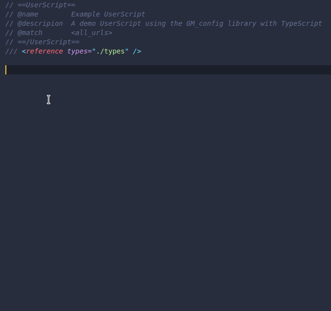

For GM_config usage information, read the [wiki](https://github.com/sizzlemctwizzle/GM_config/wiki/).

See what GM_config can do with:

* a server side live example please visit the [demo page](https://sizzlemctwizzle.github.io/GM_config/).
* a client side live example please visit the [GM_config Unit Test](https://openuserjs.org/scripts/sizzle/The_GM_config_Unit_Test), install the user script, and refresh that same page. Check out the [Userscript Beginners HOWTO](https://openuserjs.org/about/Userscript-Beginners-HOWTO) if you are new to user scripts.

For TypeScript developers, types are available in the types/ directory.
They can be included by adding the following like to a TypeScript file:

```typescript
/// <reference path="local/path/to/types/directory" />
```

Demo:


